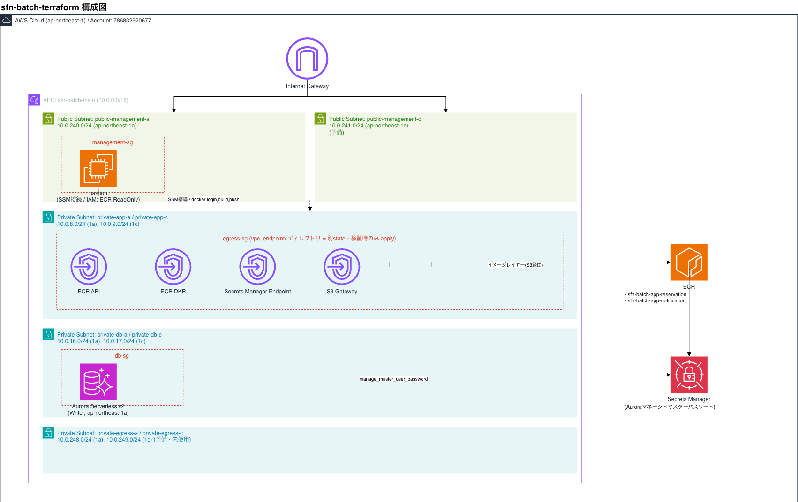

# sfn-batch-terraform

## 構成

- ルート直下: VPC・サブネット・セキュリティグループ・bastion(EC2 + SSM)・Aurora Serverless v2・ECRを管理(1つのstate)
- [vpc_endpoint/](vpc_endpoint/): ECR API/DKR・S3のVPCエンドポイントを**別state**で管理。Interfaceエンドポイントは時間課金のため、検証時以外は削除しておく運用とする
- 構成図: [docs/architecture.drawio](docs/architecture.drawio)([draw.io](https://app.diagrams.net/?splash=0&libs=aws4)で開ける。AWS公式アイコンで作成)



## 前提ツール

- terraform
- AWS CLI v2(認証設定済み)
- session-manager-plugin(bastionへのSSM接続用)
- docker

## 初回セットアップ(ルート)

```bash
terraform init
terraform apply
```

bastion・Aurora・ECR・SG等、常時稼働するリソース一式が作成される。

## 検証開始手順

### 1. VPCエンドポイントを作成

bastionからECRを利用するために必要(このエンドポイントが無いとECRへ到達できない)。

```bash
cd vpc_endpoint
terraform init   # 初回のみ
terraform apply
cd ..
```

### 2. bastion(EC2)を起動
- AWSマネジメントコンソールから手動起動する

### 3. bastion上でDockerデーモンを起動(初回 or 再起動後)

```bash
sudo systemctl start docker
```

`permission denied`になる場合は`ec2-user`をdockerグループに追加し、SSMセッションを繋ぎ直す。

```bash
sudo usermod -aG docker ec2-user
```

### 4. ECRにログイン

```bash
ACCOUNT_ID=$(aws sts get-caller-identity --query Account --output text)

aws ecr get-login-password --region ap-northeast-1 \
  | docker login --username AWS --password-stdin "${ACCOUNT_ID}.dkr.ecr.ap-northeast-1.amazonaws.com"
```

### 5. イメージのbuild・push(例: reservation)

```bash
docker buildx build -t sfn-batch-app-reservation -f ./deployments/docker/Dockerfile.reservation .
docker tag sfn-batch-app-reservation:latest "${ACCOUNT_ID}.dkr.ecr.ap-northeast-1.amazonaws.com/sfn-batch-app-reservation:latest"
docker push "${ACCOUNT_ID}.dkr.ecr.ap-northeast-1.amazonaws.com/sfn-batch-app-reservation:latest"
```

## 検証終了手順
### 1. VPCエンドポイントを削除(コスト削減)

```bash
cd vpc_endpoint
terraform destroy
cd ..
```

### 2. bastion(EC2)を停止(コスト削減)
- AWSマネジメントコンソールから手動停止する

## 注意事項

- Aurora Serverless v2は`seconds_until_auto_pause`によりアイドル時に自動でスケールダウンするため、手動停止は不要
- VPCエンドポイントを削除している間は、bastionからECRへの`docker login`・pull・pushができない(代替の経路が無いため)。検証開始時は必ず先に[vpc_endpoint/](vpc_endpoint/)を`apply`すること
- `deletion_protection = true`が設定されているリソース(Auroraクラスターなど)を削除する場合は、事前にコード側で`false`に変更して`apply`してから`destroy`する
